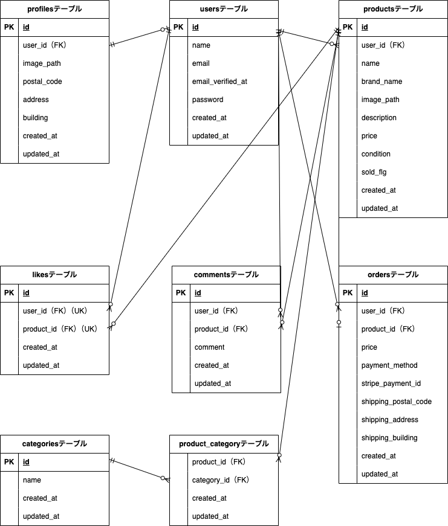

# flea_market

フリマアプリケーション

## アプリケーション名

coachtechフリマ

## 環境構築

### 前提条件

- Docker/Docker Composeがインストールされていること
- Gitがインストールされていること

### Dockerビルド

1. リポジトリをクローン

```bash
git clone git@github.com:yyuka2000-collab/flea_market.git
または
git clone https://github.com/yyuka2000-collab/flea_market.git

cd flea_market
```

2. Dockerコンテナをビルド・起動

```bash
docker-compose up -d --build
```

### Laravel環境構築

1. PHPコンテナに入る

```bash
docker-compose exec php bash
```

2. Composerで依存関係をインストール

```bash
composer install
```

3. 環境変数ファイルを作成

```bash
cp .env.example .env
```

`.env`ファイルを開き、以下の項目を環境に合わせて設定してください。

```env
DB_CONNECTION=mysql
DB_HOST=mysql
DB_PORT=3306
DB_DATABASE=laravel_db      # 任意のデータベース名
DB_USERNAME=laravel_user    # MySQLのユーザー名
DB_PASSWORD=laravel_pass    # MySQLのパスワード
```

4. アプリケーションキーを生成

```bash
php artisan key:generate
```

5. マイグレーション＆シーディングを実行

```bash
php artisan migrate:fresh --seed
```

6. ストレージのシンボリックリンク作成

```bash
php artisan storage:link
```

## 使用技術（実行環境）

- **PHP**: 8.1
- **Laravel**: 8.0
- **MySQL**: 8.0.26
- **nginx**: 1.21.1

## ER図



## 機能一覧

### 認証機能

- 会員登録（Fortify使用）
- ログイン／ログアウト（Fortify使用）
- メール認証機能（応用機能）

### 商品一覧機能

- 全商品一覧表示（購入済み商品は「Sold」表示）
- マイリスト表示（いいねした商品のみ）
- 商品名での部分一致検索
  - 検索状態がマイリストでも保持される

### 商品詳細機能

- 商品情報表示（画像・名前・価格・ブランド・カテゴリ・状態・説明）
- コメント一覧表示
- いいね追加／解除機能
- コメント送信機能（ログインユーザーのみ）

### 商品購入機能

- 支払い方法選択（コンビニ支払い／カード支払い）
- Stripe決済連携
- 配送先住所変更機能

### 商品出品機能

- 商品画像アップロード（Laravelストレージ保存）
- カテゴリ複数選択
- 商品情報登録（名前・ブランド・説明・価格・状態）

### プロフィール機能

- プロフィール情報表示（画像・ユーザー名・出品／購入商品一覧）
- プロフィール編集（画像・ユーザー名・郵便番号・住所・建物名）

## URL

- **商品一覧画面**: http://localhost/
- **商品一覧画面（マイリスト）**: http://localhost/?tab=mylist
- **会員登録画面**: http://localhost/register
- **ログイン画面**: http://localhost/login
- **商品詳細画面**: http://localhost/item/{item_id}
- **商品購入画面**: http://localhost/purchase/{item_id}
- **送付先住所変更画面**: http://localhost/purchase/address/{item_id}
- **商品出品画面**: http://localhost/sell
- **プロフィール画面**: http://localhost/mypage
- **プロフィール編集画面**: http://localhost/mypage/profile
- **プロフィール画面（購入した商品）**: http://localhost/mypage?page=buy
- **プロフィール画面（出品した商品）**: http://localhost/mypage?page=sell
- **phpMyAdmin**: http://localhost:8080/
